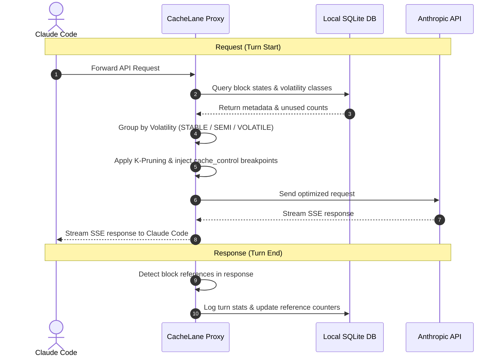
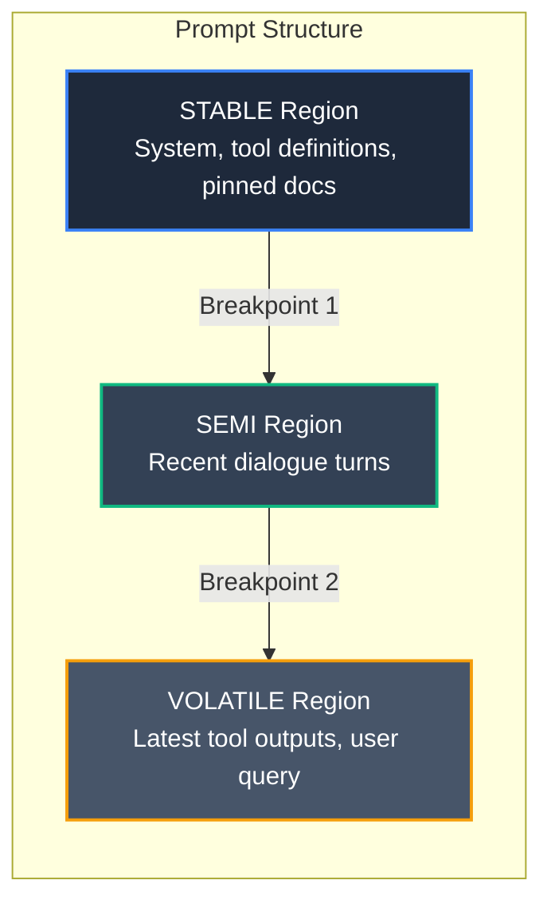
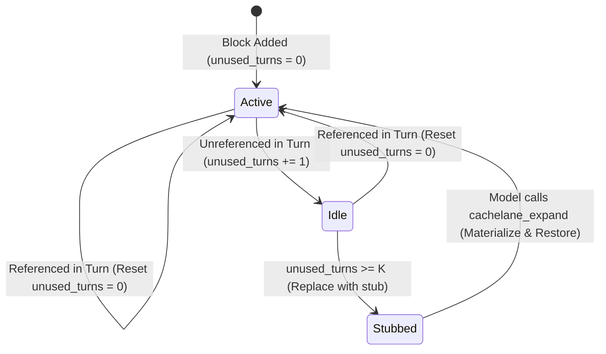

# CacheLane

[](https://nodejs.org)
[](LICENSE)

> **A local cache-discipline layer for Claude Code.**
>
> CacheLane sits between Claude Code and `api.anthropic.com` and reorganizes each turn's prompt so Anthropic's prompt cache fires far more often, then prunes stale tool output. The result is **30–60% lower input-token cost** on long sessions — with **zero change to how you use Claude Code**.

<video src="https://github.com/Aditya-Tripuraneni/CacheLane/raw/main/web/public/cachelane.mp4" width="100%" controls autoplay loop muted></video>

---

## Quickstart

```bash
# 1. Install the CLI
npm install -g cachelane

# 2. Wire it into Claude Code (idempotent — safe to re-run)
cachelane install

# 3. Restart Claude Code so it picks up the new settings
```

**That's it.** You don't start a server, run a proxy, or change any commands. After the restart, CacheLane intercepts and optimizes every turn automatically.

> ⚠️ **Do not run `cachelane proxy` yourself.** The proxy is started *for you* (see [How it works](#how-it-works)). Running it manually collides on port 7332 and crashes with `EADDRINUSE`.

### Verify it's working

```bash
cachelane doctor                  # health check: node, config, db, mcp, hooks
cachelane sessions                # list recorded sessions + cache savings
cachelane stats --scope session   # stats for the current project's latest session
```

Run `cachelane stats` **from your project directory** — it scopes to that project automatically (see [Reading your stats](#reading-your-stats)).

---

## How it works

`cachelane install` makes two edits to your Claude Code configuration:

1. **Registers an MCP server** in `~/.claude.json` (`mcpServers.cachelane`). Claude Code launches `cachelane mcp` automatically every time it starts.
2. **Redirects API traffic** by setting `ANTHROPIC_BASE_URL=http://127.0.0.1:7332` in `~/.claude/settings.json`. This is what routes Claude Code's requests through CacheLane.

The `cachelane mcp` process does **two jobs in one process**:

- Exposes MCP tools to Claude (`cachelane_stats`, `cachelane_explain`, `cachelane_expand`, `cachelane_health`).
- Because `auto_proxy` is on by default, it **also starts the HTTP proxy** on `127.0.0.1:7332` in the same process.

So a single auto-launched process owns everything. That's why you never start anything by hand — and why running `cachelane proxy` separately would fight it for the port.

For each turn the proxy:

1. Intercepts the outgoing request from Claude Code.
2. Runs the pipeline: **classify → prune → reorder** and inserts `cache_control` breakpoints.
3. Forwards the optimized request to `api.anthropic.com` and streams the response straight back.
4. Logs metadata (hashes, token counts, hit ratios) to local SQLite.

On **any** error it forwards the original, unmodified request — CacheLane never blocks or breaks your session ([Fail-open guarantees](#fail-open-guarantees)).

### The three mechanisms

1. **Cache-Aware Prompt Orchestration** — Context is segmented into three volatility regions and two `cache_control` breakpoints are placed at the boundaries, so you pay the discounted **0.1×** cached input rate instead of **1.0×** every turn:
   - **`STABLE`** — system prompts, tool schemas, pinned files, project rules.
   - **`SEMI`** — the recent-turn history window.
   - **`VOLATILE`** — the latest user query and tool outputs.

2. **Trajectory-Aware K-Pruning** — When an injected block (large file contents, tool output) goes unreferenced for **≥ K consecutive turns** (default `K=3`), CacheLane replaces it with a compact, **non-lossy** stub holding the block ID, a short summary, and a refetch handle. Claude can restore the full content on demand via the `cachelane_expand` tool.

3. **Hybrid Adaptive Keepalive** — Sends minimal synthetic pings (`max_tokens=1`) during idle pauses to keep the prefix hot before Anthropic's 5-minute cache TTL expires. Large prefixes are promoted to the 1-hour TTL tier automatically.

---

## Reading your stats

CacheLane records every turn under a **workspace** derived from the directory Claude Code was launched in, plus the Claude Code **session id**. `cachelane stats` mirrors that:

- `cachelane stats --scope session` — the most recent session **in the current project** (run it from your project dir). With no `--session-id`, it auto-selects the latest session.
- `cachelane stats --scope workspace` — all sessions for the current project.
- `cachelane stats --scope all` — everything, across all projects.
- `cachelane sessions` — a table of every recorded session with hit ratio and savings, across all projects.

Most of the time you won't need flags — just run `cachelane stats` from your project directory. To target a specific session explicitly (e.g. one from another project), pass its id from `cachelane sessions`:

```bash
cachelane stats --scope all --session-id <session-id>
```

Sessions are keyed by Claude Code's own session id, so the value in the `cachelane sessions` table is exactly what `--session-id` expects.

---

## Command reference

### Everyday commands

| Command | Purpose |
|---------|---------|
| `cachelane install` | Register the MCP server + hooks and redirect Claude Code traffic through the proxy. Idempotent. |
| `cachelane uninstall [--purge]` | Remove the integration. `--purge` also deletes `~/.cachelane` (config + database). |
| `cachelane doctor [--json]` | Health check: Node version, config, SQLite writability, MCP + hook registration. |
| `cachelane stats [--scope session\|workspace\|all] [--json]` | Cache hit ratio, turns, pruned blocks, and estimated savings. |
| `cachelane sessions [--json]` | List all recorded sessions with hit ratio and savings. |
| `cachelane explain [--turn <N>] [--json]` | Show how CacheLane classified, reordered, and pruned blocks for a turn. |
| `cachelane config` | Print the active configuration. |

### Tuning

| Command | Purpose |
|---------|---------|
| `cachelane prune --default \| --aggressive \| --conservative` | Set the K-pruning threshold (`K=3`, `K=2`, or `K=5`). |
| `cachelane keepalive off \| static \| adaptive \| auto` | Configure cache-TTL keepalive behavior. |
| `cachelane pin <file\|glob>` | Pin files into the `STABLE` region so they're never pruned. |
| `cachelane exclude <file\|glob>` | Exclude files from cache-aware classification. |
| `cachelane enable` / `cachelane disable` | Toggle pruning without uninstalling. |

### Internal / advanced

These are run for you or are for debugging; you normally never invoke them:

| Command | Purpose |
|---------|---------|
| `cachelane mcp` | The MCP + proxy server. **Auto-started by Claude Code** — don't run it manually. |
| `cachelane proxy [--port]` | Standalone proxy, for setups *not* using the MCP server. Collides with the auto-started proxy if both run. |
| `cachelane debug pruner [--limit <N>]` | Dump recent pruner debug entries as JSON. |
| `cachelane benchmark <compare\|live-report\|ab-test\|dashboard>` | Local benchmarking / live savings dashboard. |
| `cachelane hook <name>` | Claude Code hook entrypoint (records turn stats in hook mode). |

### MCP tools (exposed to Claude)

When the server is running, Claude can call:

- `cachelane_stats` — session/workspace cache + savings aggregates.
- `cachelane_explain` — structured explanation of region breakpoints and prune decisions.
- `cachelane_expand` — restore a pruned stub's full content into the next turn.
- `cachelane_health` — health status and degraded-fallback metrics.

---

## Configuration

Settings live in `~/.cachelane/config.json` and can be edited via the tuning commands above. Defaults:

| Setting | Default |
|---------|---------|
| Pruner | enabled, `K=3` |
| Keepalive | `auto` (ping ~2.5 min idle; 1-hour TTL tier above ~50k-token prefixes) |
| Proxy | `127.0.0.1:7332` → upstream `api.anthropic.com:443` |
| Auto-proxy | on (MCP server starts the proxy in-process) |
| Telemetry | **off** (opt-in only) |

---

## Files & data storage

All state is local:

| Path | Contents |
|------|----------|
| `~/.cachelane/config.json` | Configuration |
| `~/.cachelane/cachelane.db` | SQLite log — block hashes, token counts, hit stats (**never** prompt text) |
| `~/.cachelane/cachelane.log` | Rotating log (10 MB × 5 files) |
| `~/.claude.json` | MCP server registration (`mcpServers.cachelane`) |
| `~/.claude/settings.json` | `ANTHROPIC_BASE_URL` redirect + hook entries |
| `~/.claude/hooks/cachelane.json` | Hook marker (read by `cachelane doctor`) |

---

## Security & privacy (100% local-first)

- **No SaaS backend.** No prompt text, responses, or file contents leave your machine except directly to `api.anthropic.com` over TLS.
- **Metadata-only SQLite.** The database stores block hashes, token counts, and hit statistics — never prompt bodies, secrets, or file contents.
- **Opt-in telemetry.** Disabled by default. If enabled, it reports only high-level aggregates (cache ratios, savings) and strips paths, prompt text, workspace IDs, and keys.

---

## Fail-open guarantees

A caching layer must never break your editor or disconnect you from your assistant. If CacheLane hits **any** problem — SQLite errors, config corruption, Node version mismatch, an uncaught exception in the request path — it logs to `~/.cachelane/cachelane.log` and **immediately forwards the unmodified request** to Anthropic. It will never block the model, slow Claude Code, or crash your session.

CacheLane also enforces a **cache-stability gate**: the SHA-256 of the orchestrated prefix region must be byte-identical across repeated identical-input runs, preventing cache-busting drift from timestamps, random seeds, or unordered fields.

---

## For contributors

### Build from source

```bash
git clone https://github.com/Aditya-Tripuraneni/CacheLane.git
cd CacheLane
npm install
npm run build
npm link        # exposes the `cachelane` command from your local build
```

### Tests & checks

> **Node version:** use **Node 20** — `better-sqlite3`'s native bindings are precompiled for it. Newer majors may fail to load the binding.

```bash
npm test            # vitest run (full suite)
npm run lint        # eslint
npx tsc --noEmit    # typecheck
npm run doctor:ci   # CI-friendly install/health check
```

### Deterministic benchmark harness

Audit savings locally without spending API credits — replays pre-recorded sessions:

```bash
npm run benchmark:recorded
```

It reports baseline vs. effective cost units and the resulting savings ratio; output is written under `benchmark/runs/`.

---

## Architecture diagrams

### Interception lifecycle



### Orchestrated prompt layout



### K-Pruning state diagram



---

## License

[Apache-2.0](LICENSE)
