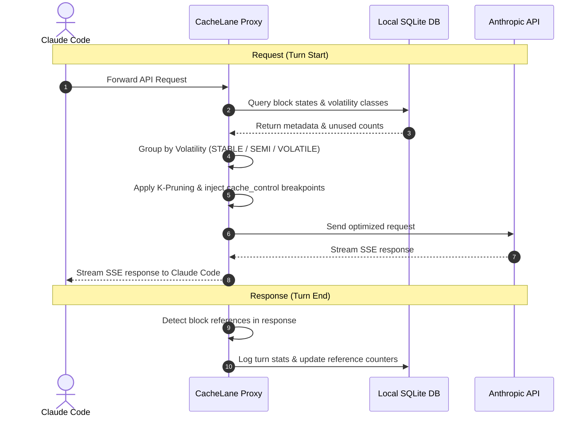
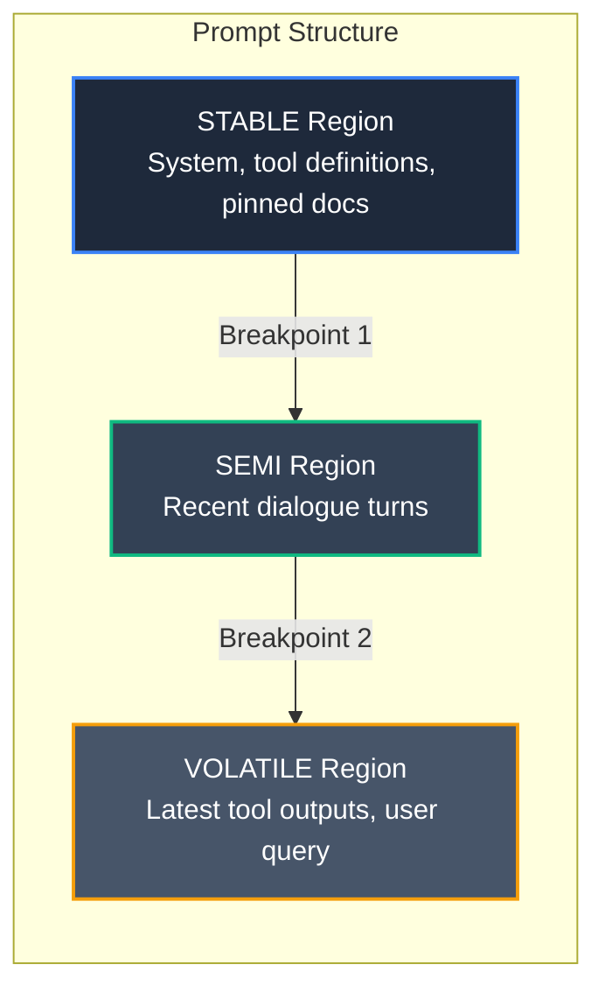
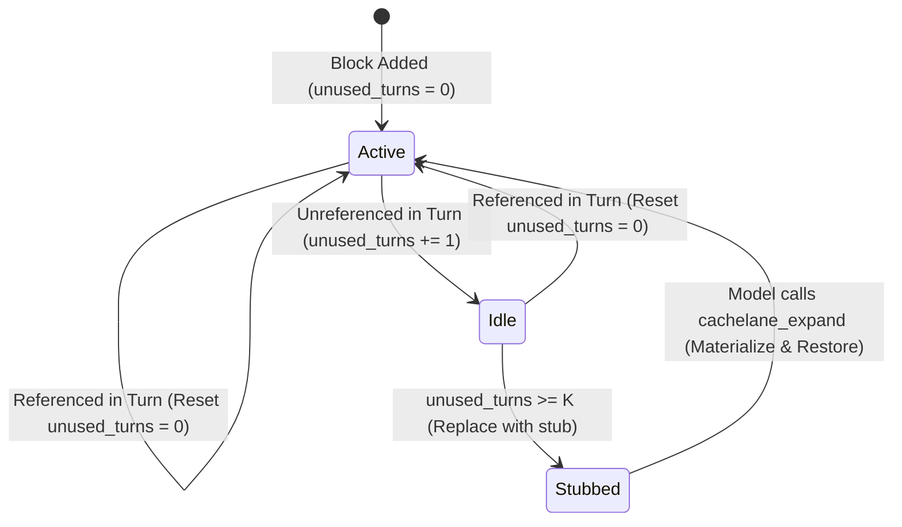

# CacheLane

[](https://cache-lane.vercel.app/)
[](https://nodejs.org)
[](LICENSE)

> **A local cache-discipline layer for Claude Code.**
>
> CacheLane sits between Claude Code and `api.anthropic.com` and reorganizes each turn's prompt so Anthropic's prompt cache fires far more often, then prunes stale tool output. The result is **30% to 60% lower input-token cost** on long sessions, with **zero change to how you use Claude Code**.
>
> 🌐 **Website:** [cache-lane.vercel.app](https://cache-lane.vercel.app/)

<video src="https://github.com/Aditya-Tripuraneni/CacheLane/raw/main/web/public/cachelane.mp4" width="100%" controls autoplay loop muted></video>

---

## Quickstart

```bash
# 1. Install the CLI
npm install -g cachelane

# 2. Wire it into Claude Code (idempotent, safe to re-run)
cachelane install

# 3. Restart Claude Code so it picks up the new settings
```

**That's it.** You don't start a server, run a proxy, or change any commands. After the restart, CacheLane intercepts and optimizes every turn automatically.

> ⚠️ **Do not run `cachelane proxy` yourself.** The proxy is started *for you* (see [How it works](#how-it-works)). Running it manually collides on port 7332 and crashes with `EADDRINUSE`.

### Verify it's working

```bash
cachelane doctor                  # health check: node, config, db, mcp, hooks
cachelane sessions                # list recorded sessions + cache savings
cachelane stats --scope session   # stats for the current project's latest session
```

Run `cachelane stats` **from your project directory**. It scopes to that project automatically (see [Reading your stats](#reading-your-stats)).

---

## Why it saves money (the intuition)

> **In one breath:** the Claude API is stateless, so Claude Code re-sends your whole conversation on every turn and you pay for it again and again. CacheLane marks the unchanging part with cache breakpoints so it stays identical and rides Anthropic's prompt cache at **one-tenth** the price, then trims stale tool output. The longer the session, the more you save.

### 1. The problem: the API is stateless

Claude does not keep your conversation on Anthropic's servers between requests. The Messages API is **stateless**, which means the client (Claude Code) has to send the **entire** conversation again on every turn:

```
Turn 1 sends:  [ system + tools ][ file ][ msg 1 ]
Turn 2 sends:  [ system + tools ][ file ][ msg 1 ][ reply ][ msg 2 ]
Turn 3 sends:  [ system + tools ][ file ][ msg 1 ][ reply ][ msg 2 ][ reply ][ msg 3 ]
                |............ the same stuff, re-sent every turn ............|
```

Normally you pay full price for all of it on every turn. That repetition is the waste CacheLane removes.

> **Source:** Anthropic, [Using the Messages API](https://docs.anthropic.com/en/api/messages-examples): *"The Messages API is stateless, which means that you always send the full conversational history to the API."* New turns are added by **appending** to the `messages` array, so conversation cost grows with length.
>
> **"But Claude has a memory feature."** That is a different mechanism and it does not change the above. Memory tools and memory files work by saving notes to a file and then reading that file back **into the prompt** on later turns. The content still travels inside every request; the model is not recalling it from a saved server-side session.

### 2. The discount it chases

Anthropic's prompt cache bills a *repeated prefix* at a fraction of the normal input price. The exact multipliers, straight from Anthropic's documentation:

| Token type | Price vs. base input |
|---|---|
| Normal input (uncached) | **1×** |
| Cache **write** (5-minute TTL) | **1.25×** |
| Cache **write** (1-hour TTL) | **2×** |
| Cache **read** (hit) | **0.1×** |

> **Source:** Anthropic, [Prompt caching](https://docs.anthropic.com/en/docs/build-with-claude/prompt-caching): *"5-minute cache write tokens are 1.25 times the base input tokens price; 1-hour cache write tokens are 2 times the base input tokens price; cache read tokens are 0.1 times the base input tokens price."* See also Anthropic [Pricing](https://docs.anthropic.com/en/docs/about-claude/pricing).

The catch is in **how** the cache matches. Anthropic caches the **prefix** of a request up to a `cache_control` breakpoint, and a request reuses *"the longest prefix that a prior request already wrote to the cache."* The match stops at the first token that differs; everything after that point is billed at full price.

New turns append to the **end** of the conversation, so the front is naturally stable. The thing that actually breaks caching is **volatile content sitting ahead of stable content**: a freshly injected tool result, a changing system reminder, or a block whose order or formatting shifts between turns. If any of that lands before your expensive stable content (system prompt, tool schemas, large files), the prefix diverges early and the stable content after it can no longer be served from cache.

> **Source:** Anthropic, [Prompt caching](https://docs.anthropic.com/en/docs/build-with-claude/prompt-caching): *"Cache writes happen only at your breakpoint. Marking a block with `cache_control` writes exactly one cache entry: a hash of the prefix ending at that block."* The system *"automatically find[s] the longest prefix that a prior request already wrote to the cache."*
>
> **What about Anthropic's _automatic caching_?** Anthropic can place one breakpoint for you — on the *last cacheable block*, advanced as the conversation grows, with a 20-block lookback ([Prompt caching](https://docs.anthropic.com/en/docs/build-with-claude/prompt-caching)). But it still only *places a breakpoint*: it never reorders your prompt and never prunes idle content. CacheLane's breakpoint placement is on par with using native caching well — its **additional** savings come from K-pruning and keepalive (below), which the API has no equivalent for.

### 3. The trick: mark the cache boundaries (without moving anything)

CacheLane classifies each request into three **volatility regions** and places two `cache_control` breakpoints at the boundaries. It does **not** reorder your conversation: the API already sends `system` and `tools` before `messages`, and new turns append to the end, so the stable material is naturally at the front. CacheLane only marks *where* the cache boundaries sit (and strips/replaces any breakpoints Claude Code already set):

```
+----------------------------------------+
| STABLE    system prompt, tool schemas, |  identical every turn
|           CLAUDE.md, pinned rules      |  -> billed at 0.1x
| ============ cache breakpoint ======== |
| SEMI      recent turns + files read    |
| ============ cache breakpoint ======== |
| VOLATILE  your newest message + latest |  the only genuinely new part
|           tool output                  |  -> full price, but small
+----------------------------------------+
```

The expensive stable block sits at the front of every request by API structure and stays byte-identical, so the breakpoint lets Anthropic serve it from cache cheaply. The volatile material is already at the back — where its churn can't invalidate anything above it — so CacheLane never has to move it. Only the small new piece at the bottom pays full price.

### 4. Worked example: "read a file"

Say the unchanging stuff (system + tools + the file) is **15,000 tokens**, and each new message is **500 tokens**.

| Turn | What happens | Cost (token-units) |
|------|--------------|--------------------|
| 1 (read file X) | Nothing cached yet; the stable block is *written* to cache at 1.25× | `15,000×1.25 + 500` ≈ **19,250** |
| 2 (explain `foo`) | Stable block is now a cache hit at 0.1× | `15,000×0.1 + 500` ≈ **2,000** |
| 3, 4, 5 … | Same cheap path every turn | ≈ **2,000** each |

Per-turn cost collapses after the first turn:

```
cost/turn
 19k | #                              turn 1: pay once to seed the cache
     |
 10k |
     |
  2k |   #  #  #  #  #  #  #  #  #     every turn after: flat and cheap
     +-------------------------------
       1  2  3  4  5  6  7  8  9 ...
```

> **"Read that file again"?** It's already in the cached front, so it costs 0.1×, basically free. You never re-pay full price for it.

### 5. Why the savings grow with session length (the math)

Let `S` = the size of the **repeated** part of your prompt (system + tools + files already read), the part CacheLane keeps stable. Over `N` turns, what do you pay for that part?

```
Without caching:   N x S            (full 1x price, every turn)

With CacheLane:    1.25 * S         (write it once, on turn 1)
                 + (N - 1) * 0.1*S  (cheap 0.1x read, every turn after)
```

Divide the CacheLane cost by `N` to get the **average per-turn cost** (per unit of `S`):

```
  1.25*S + (N - 1)*0.1*S                  1.15
  ----------------------- =  ( 0.1  +  -------- ) * S
            N                              N
```

That single formula is the whole story (the multipliers `1.25` and `0.1` are the cited Anthropic rates above):

| Turns `N` | avg per-turn cost | savings vs. full price |
|-----------|-------------------|------------------------|
| 1 | 1.25× | (just the write) |
| 2 | 0.675× | ~32% |
| 10 | 0.215× | ~78% |
| 50 | 0.123× | ~88% |
| large N | **0.1×** | **90% (the ceiling)** |

As the session grows, the one-time `1.15/N` write cost shrinks toward zero and the average slides down to **0.1×**, i.e. a **90% discount** on the repeated part. That 90% is not a marketing number. It is exactly the cache-read multiplier (`0.1×`) from the table above, and it is the theoretical ceiling. Real sessions also carry a small always-full-price "new" part each turn plus the occasional cache miss, which pulls the *measured* number down to roughly **80%**, which is what `cachelane stats` reports in practice. Short chats sit low on this curve; long coding sessions ride near the top.

### 6. Keeping it lean: K-pruning and stubs

Caching makes the prompt *cheap*, but a long session still makes it *big*. Old tool outputs and file dumps pile up after they stop being relevant. So CacheLane tracks how many turns each block goes untouched, and once a block has been idle for **K turns** (default `K = 3`) it swaps the full content for a tiny **stub**:

```
Claude Code sends:   [ ...history... ][ 5,000-token file ][ new msg ]
                                        |  idle for K turns
                                        v  CacheLane substitutes (forwarded copy only)
Anthropic receives:  [ ...history... ][ stub: id + summary + expand() ][ new msg ]
```

This is **lossless, and nothing is ever stored.** CacheLane does not keep your content. Claude Code still holds the original and re-sends it every turn; CacheLane just masks it in the copy forwarded to Anthropic. If the model needs it back, it calls the `cachelane_expand` MCP tool, CacheLane flips that block from "stub" to "live", and the real content flows through again on the next turn. (Expanding is far cheaper than re-reading the file from scratch: the call carries just a block id, and it re-uses the existing cache entry instead of paying a fresh `1×` read **plus** a `1.25×` cache write for newly-read content.)

### 7. Why there's a database

Placing breakpoints on one request needs no memory, but pruning and restoring are stateful across turns. So CacheLane keeps a local SQLite database (`~/.cachelane/cachelane.db`) holding **only metadata**:

- **Idle counters:** "this block has been untouched for 3 turns" is impossible to know without history.
- **Stub state and refetch handles:** which blocks are currently masked, and how `cachelane_expand` puts them back.
- **Prefix hashes:** to confirm the stable region really stayed byte-identical (so the cache will hit) and to detect drift.
- **Keepalive state:** which sessions are idle and how big their prefix is.
- **Stats:** token counts, hit ratios, and savings that power `cachelane stats`, `sessions`, and `explain`.

It never stores your prompts, code, or secrets, only hashes, counts, and short summaries.

### 8. Keeping the cache warm (keepalive)

Anthropic's cache lives about 5 minutes by default; a 1-hour tier is available at 2× write cost ([Prompt caching](https://docs.anthropic.com/en/docs/build-with-claude/prompt-caching)). If you step away mid-session, the cache would expire and your next turn would pay full price to re-seed it. So a keepalive worker sends a minimal synthetic ping (`max_tokens=1`) during idle gaps to keep the prefix hot, and CacheLane promotes large prefixes (≥ 50k tokens) to that 1-hour tier automatically.

---

## How it works

`cachelane install` makes two edits to your Claude Code configuration:

1. **Registers an MCP server** in `~/.claude.json` (`mcpServers.cachelane`). Claude Code launches `cachelane mcp` automatically every time it starts.
2. **Redirects API traffic** by setting `ANTHROPIC_BASE_URL=http://127.0.0.1:7332` in `~/.claude/settings.json`. This is what routes Claude Code's requests through CacheLane.

The `cachelane mcp` process does **two jobs in one process**:

- Exposes MCP tools to Claude (`cachelane_stats`, `cachelane_explain`, `cachelane_expand`, `cachelane_health`).
- Because `auto_proxy` is on by default, it **also starts the HTTP proxy** on `127.0.0.1:7332` in the same process.

So a single auto-launched process owns everything. That's why you never start anything by hand, and why running `cachelane proxy` separately would fight it for the port.

For each turn the proxy:

1. Intercepts the outgoing request from Claude Code.
2. Runs the pipeline (**classify → prune → place `cache_control` breakpoints**).
3. Forwards the optimized request to `api.anthropic.com` and streams the response straight back.
4. Logs metadata (hashes, token counts, hit ratios) to local SQLite.

On **any** error it forwards the original, unmodified request, so CacheLane never blocks or breaks your session ([Fail-open guarantees](#fail-open-guarantees)). The three mechanisms behind the savings (cache-aware orchestration, K-pruning, and keepalive) are explained in [Why it saves money](#why-it-saves-money-the-intuition) above.

---

## Reading your stats

CacheLane records every turn under a **workspace** derived from the directory Claude Code was launched in, plus the Claude Code **session id**. `cachelane stats` mirrors that:

- `cachelane stats --scope session`: the most recent session **in the current project** (run it from your project dir). With no `--session-id`, it auto-selects the latest session.
- `cachelane stats --scope workspace`: all sessions for the current project.
- `cachelane stats --scope all`: everything, across all projects.
- `cachelane sessions`: a table of every recorded session with hit ratio and savings, across all projects.

Most of the time you won't need flags. Just run `cachelane stats` from your project directory. To target a specific session explicitly (for example one from another project), pass its id from `cachelane sessions`:

```bash
cachelane stats --scope all --session-id <session-id>
```

Sessions are keyed by Claude Code's own session id, so the value in the `cachelane sessions` table is exactly what `--session-id` expects.

---

## Command reference

### Everyday commands

| Command | Purpose |
|---------|---------|
| `cachelane install` | Register the MCP server + hooks and redirect Claude Code traffic through the proxy. Idempotent. |
| `cachelane uninstall [--purge]` | Remove the integration. `--purge` also deletes `~/.cachelane` (config + database). |
| `cachelane doctor [--json]` | Health check: Node version, config, SQLite writability, MCP + hook registration. |
| `cachelane stats [--scope session\|workspace\|all] [--json]` | Cache hit ratio, turns, pruned blocks, and estimated savings. |
| `cachelane sessions [--json]` | List all recorded sessions with hit ratio and savings. |
| `cachelane explain [--turn <N>] [--json]` | Show how CacheLane classified and pruned blocks, and where it placed cache breakpoints, for a turn. |
| `cachelane config` | Print the active configuration. |

### Tuning

| Command | Purpose |
|---------|---------|
| `cachelane prune --default \| --aggressive \| --conservative` | Set the K-pruning threshold (`K=3`, `K=2`, or `K=5`). |
| `cachelane keepalive off \| static \| adaptive \| auto` | Configure cache-TTL keepalive behavior. |
| `cachelane pin <file\|glob>` | Pin files into the `STABLE` region so they're never pruned. |
| `cachelane exclude <file\|glob>` | Exclude files from cache-aware classification. |
| `cachelane enable` / `cachelane disable` | Toggle pruning without uninstalling. |

### Internal / advanced

These are run for you or are for debugging; you normally never invoke them:

| Command | Purpose |
|---------|---------|
| `cachelane mcp` | The MCP + proxy server. **Auto-started by Claude Code.** Do not run it manually. |
| `cachelane proxy [--port]` | Standalone proxy, for setups *not* using the MCP server. Collides with the auto-started proxy if both run. |
| `cachelane debug pruner [--limit <N>]` | Dump recent pruner debug entries as JSON. |
| `cachelane benchmark <compare\|live-report\|ab-test\|dashboard>` | Local benchmarking / live savings dashboard. |
| `cachelane hook <name>` | Claude Code hook entrypoint (records turn stats in hook mode). |

### MCP tools (exposed to Claude)

When the server is running, Claude can call:

- `cachelane_stats`: session/workspace cache and savings aggregates.
- `cachelane_explain`: structured explanation of region breakpoints and prune decisions.
- `cachelane_expand`: restore a pruned stub's full content into the next turn.
- `cachelane_health`: health status and degraded-fallback metrics.

---

## Configuration

Settings live in `~/.cachelane/config.json` and can be edited via the tuning commands above. Defaults:

| Setting | Default |
|---------|---------|
| Pruner | enabled, `K=3` |
| Keepalive | `auto` (ping every ~2.5 min after ~4 min idle; 1-hour TTL tier above 50k-token prefixes) |
| Proxy | `127.0.0.1:7332`, upstream `api.anthropic.com:443` |
| Auto-proxy | on (MCP server starts the proxy in-process) |
| Telemetry | **off** (opt-in only) |

---

## Chaining with another proxy (e.g. a token optimizer)

CacheLane is compatible with another local proxy in front of `api.anthropic.com` — you **chain** them rather than choosing one. CacheLane's upstream is configurable (it is *not* hardcoded to Anthropic): set `proxy.upstream_host` / `upstream_port` / `upstream_ssl` / `upstream_path_prefix` in `~/.cachelane/config.json`. Run `cachelane config` to print the active values.

**Put CacheLane *last*, immediately before Anthropic.** Its entire benefit comes from arranging blocks and placing `cache_control` breakpoints so the Anthropic prompt cache fires at 0.1×. That depends on the *exact bytes Anthropic receives* being the ones CacheLane arranged — so CacheLane should be the hop that talks to Anthropic. Any proxy that rewrites the body *after* CacheLane can shift or invalidate those breakpoints and defeat the cache.

```
Claude Code  ──►  Other proxy (:8787)  ──►  CacheLane (:7332)  ──►  api.anthropic.com
```

- Keep `ANTHROPIC_BASE_URL=http://localhost:8787` pointed at the other proxy.
- Point the **other proxy's** upstream at CacheLane (`http://localhost:7332`) instead of directly at Anthropic.
- Leave CacheLane's upstream at the default (`api.anthropic.com`).

**If the other proxy can't be repointed** (only Claude Code's base URL is configurable), chain it the other way and set CacheLane's upstream to that proxy:

```
Claude Code  ──►  CacheLane (:7332)  ──►  Other proxy (:8787)  ──►  api.anthropic.com
```

- Set `ANTHROPIC_BASE_URL=http://localhost:7332`.
- In `~/.cachelane/config.json`, set `proxy.upstream_host: "127.0.0.1"`, `proxy.upstream_port: 8787`, `proxy.upstream_ssl: false` (a local proxy is typically plain HTTP).
- Caveat: the other proxy is now the last hop and may mutate the body, which can disturb CacheLane's `cache_control` placement and reduce the realized cache savings.

**Caveats when stacking two token-reduction layers:** they may overlap or interact (e.g. one stripping content the other expects to stub/refetch). Verify with `cachelane stats` that you're still seeing cache reads and reduction after chaining.

**Verify the chain is healthy:** after wiring two proxies together, run `cachelane doctor --probe` to confirm CacheLane's configured upstream is reachable and that cache reads are still firing. If `cache_reads` warns that reads dropped to ~0, the other layer may be stripping content CacheLane needs to cache — see the caveats above.

> Running a chain like this means *not* using the zero-config auto-proxy — you start `cachelane proxy` yourself and manage the `ANTHROPIC_BASE_URL` wiring manually.

---

## Files & data storage

All state is local:

| Path | Contents |
|------|----------|
| `~/.cachelane/config.json` | Configuration |
| `~/.cachelane/cachelane.db` | SQLite log: block hashes, token counts, hit stats (**never** prompt text) |
| `~/.cachelane/cachelane.log` | Rotating log (10 MB × 5 files) |
| `~/.claude.json` | MCP server registration (`mcpServers.cachelane`) |
| `~/.claude/settings.json` | `ANTHROPIC_BASE_URL` redirect + hook entries |
| `~/.claude/hooks/cachelane.json` | Hook marker (read by `cachelane doctor`) |

---

## Security & privacy (100% local-first)

- **No SaaS backend.** No prompt text, responses, or file contents leave your machine except directly to `api.anthropic.com` over TLS.
- **Metadata-only SQLite.** The database stores block hashes, token counts, and hit statistics, never prompt bodies, secrets, or file contents.
- **Opt-in telemetry.** Disabled by default. If enabled, it reports only high-level aggregates (cache ratios, savings) and strips paths, prompt text, workspace IDs, and keys.

---

## Fail-open guarantees

A caching layer must never break your editor or disconnect you from your assistant. If CacheLane hits **any** problem (SQLite errors, config corruption, Node version mismatch, an uncaught exception in the request path), it logs to `~/.cachelane/cachelane.log` and **immediately forwards the unmodified request** to Anthropic. It will never block the model, slow Claude Code, or crash your session.

CacheLane also enforces a **cache-stability gate**: the SHA-256 of the orchestrated prefix region must be byte-identical across repeated identical-input runs, preventing cache-busting drift from timestamps, random seeds, or unordered fields.

---

## For contributors

### Build from source

```bash
git clone https://github.com/Aditya-Tripuraneni/CacheLane.git
cd CacheLane
npm install
npm run build
npm link        # exposes the `cachelane` command from your local build
```

### Tests & checks

> **Node version:** use **Node 20**. `better-sqlite3`'s native bindings are precompiled for it, and newer majors may fail to load the binding.

```bash
npm test            # vitest run (full suite)
npm run lint        # eslint
npx tsc --noEmit    # typecheck
npm run doctor:ci   # CI-friendly install/health check
```

### Deterministic benchmark harness

Audit savings locally without spending API credits. This replays pre-recorded sessions:

```bash
npm run benchmark:recorded
```

It reports baseline vs. effective cost units and the resulting savings ratio; output is written under `benchmark/runs/`.

---

## Architecture diagrams

### Interception lifecycle



### Orchestrated prompt layout



### K-Pruning state diagram



---

## License

[Apache-2.0](LICENSE)
